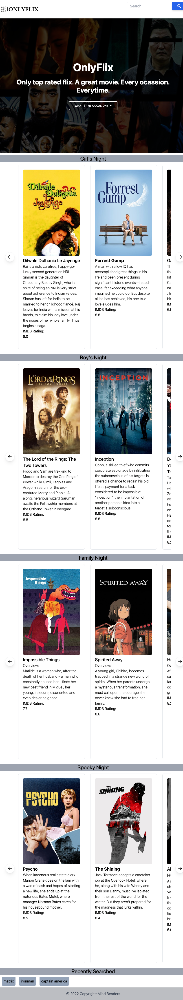

# OnlyFlix

## Description

ONLYFLIX is a movie search engine which allows users to type in search and receive corresponding movie result which are displayed with relevant information such as rating and title. 

## USER STORY 

AS A movie lover,
I WANT to find the best rated movies,
SO THAT I can enjoy a good movie.

## ACCEPTANCE CRITERIA 

OnlyFlix features dynamically updated HTML and CSS. Specifically using the css framework Tailwind and Jquery for functionality. Retrieving data from another application's API and using it in the application.

## Technology

OnlyFlix uses the OMDB API, TMDB API, as well as Tailwind CSS.

## Visual Presentation

## Links

[Github Repo](https://github.com/RosalvaMartinez/OnlyFlix)

[OnlyFlix Application](https://rosalvamartinez.github.io/OnlyFlix/)
